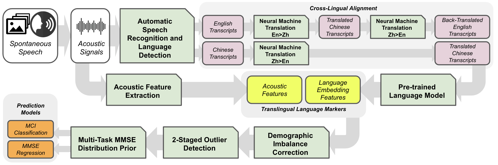

# translingual-language-markers
Official Code for Paper: "Translingual Language Markers for Cognitive Assessment from Spontaneous Speech" Bao Hoang, Yijiang Pang, Hiroko Dodge, and Jiayu Zhou, *InterSpeech* 2024

## Overview

Mild Cognitive Impairment (MCI) is considered a prodromal stage of dementia, including Alzheimer's disease. It is characterized by behavioral changes and decreased cognitive function, while individuals can still maintain their independence.  Early detection of MCI is critical, as it allows for timely intervention, enrichment of clinical trial cohorts, and the development of therapeutic approaches. Recently, language markers have been shown to be a promising approach to identifying MCI in a non-intrusive, affordable, and accessible fashion. In the InterSpeech 2024 TAUKADIAL Challenge, we study language markers from spontaneous speech in English and Chinese and use the bilingual language markers to identify MCI cases and predict the Mini-Mental Status Examination (MMSE) scores. 

Our proposed framework combines the power from 
1) feature extraction of a comprehensive set of bilingual acoustic features, and semantic and syntactic features from language models; 
2) careful treatment of model complexity for small sample size;
3) consideration of imbalanced demographic structure, potential outlier removal, and a multi-task treatment that uses the prediction of clinical classification as prior for MMSE prediction. 

The proposed approach delivers an average of 78.2\% Balanced Accuracy in MCI detection and an averaged RMSE of 2.705 in predicting MMSE. Our empirical evaluation shows that translingual language markers can improve the detection of MCI from spontaneous speech. Our codes are provided in [https://github.com/illidanlab/translingual-language-markers](https://github.com/illidanlab/translingual-language-markers).

## Package dependencies
Use `conda env create -f environment.yml` to create a conda env and
activate by `conda activate InterSpeech`.

## Data Preparation

Data is available upon request to the TAUKADIAL Challenge Organizers. More information can be found at [https://taukadial-luzs-69e3bf4b9878b99a6f03aea43776344580b77b9fe54725f4.gitlab.io/](https://taukadial-luzs-69e3bf4b9878b99a6f03aea43776344580b77b9fe54725f4.gitlab.io/).

### 1. Transcribe speech
We use the Whisper Large model to transcribe speech: `python WhisperTranscribe.py --path_root ${root folder of TAUKADIAL-24 Dataset}`.

### 2. Translate
We use M2M100 model to do translation: `python WhisperTranscribe.py`.

### 3. Acoustic Feature 
We use librosa and opensmile libraries to extract acoustic feature: `python acoustic --path_root ${root folder of TAUKADIAL-24 Dataset}`.

## Demos
Here we provide several demos of results in the paper.
You can change the arguments from `main.py` to try different strategies.

### Arguments of main.py

- `--embedding-model` (string, optional, default: `"bert-base-uncased"`): 
  - Specifies the embedding model to use. 
  - Options include: `"bert-base-uncased"`, `"bert-base-multilingual-uncased"`.

- `--features` (list of strings, optional, default: `["embedding", "acoustic"]`): 
  - Defines the features to use. 
  - Options include: `"embedding"`, `"acoustic"`.

- `--acoustic` (list of strings, optional, default: `["MFCC"]`): 
  - Specifies the acoustic features to use. 
  - Options include: `"MFCC"`, `"GeMAPS"`, `"eGeMAPS"`.

- `--iteration` (integer, optional, default: `100`): 
  - The number of different train test split.

- `--embedding-layer` (string, optional, default: `"last_hidden_state"`): 
  - Specifies the embedding layer to use. 
  - Options include: `"last_hidden_state"`, `"pooler_output"`.

- `--translate` (flag, optional): 
  - If set, use back-translation method. 
  - Use as `--translate` to enable.

- `--clf` (string, optional, default: `"logistic"`): 
  - Specifies the classifier to use. 
  - Options include: `"logistic"`, `"mlp"`.

- `--reg` (string, optional, default: `"RandomForest"`): 
  - Specifies the regression model to use. 
  - Options include: `"svr"`, `"RandomForest"`.

- `--ft_sel` (flag, optional): 
  - If set, enables feature selection.
  - Use as `--ft_sel` to enable.

- `--ft_num` (integer, optional, default: `1600`): 
  - The number of features to select.

- `--flag_bad_train_filter` (flag, optional): 
  - If set, enables filtering of bad subjects by 2-stage method.
  - Use as `--flag_bad_train_filter` to enable.

- `--flag_multi_reg` (flag, optional, default: `True`): 
  - If set, enables multiple regressors for multi-tasking with MMSE distribution priors.
  - Use as `--flag_multi_reg` to enable.

- `--img_index_sbj` (list of integers, optional, default: `[0, 1, 2]`): 
  - Specifies the image indices to use as features.
  - Examples include: `[0, 1, 2]`, `[0]`.

### Examples
- Use MFCC acoustic feature:  `python main.py --features acoustic --acoustic MFCC`.

- Use embedding feature with back-translation method: `python main.py --features embedding --embedding-model bert-base-uncased --translate`.

- Use both acoustic and embedding feature: `python main.py --features embedding acoustic --translate`.

- Use LASSO feature selection method to select top 1500 features: `python main.py --ft_sel --ft_num 1500`.

- Use remove bad subjects strategy + multi regressors: `python main.py --flag_bad_train_filter --flag_multi_reg`.

## Acknowledgement
This material is based in part upon work supported by the National Science Foundation under
Grant IIS-2212174, IIS-1749940, , Office of Naval Research N00014-24-1-2168, and National
Institute on Aging (NIA) RF1AG072449.